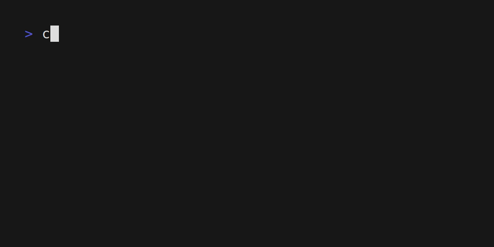

# Ethereum Blockchain Parser

## Goal

Implement Ethereum blockchain parser that will allow to query transactions for subscribed
addresses.

## Problem

Users not able to receive push notifications for incoming/outgoing transactions. By
Implementing Parser interface we would be able to hook this up to notifications service to
notify about any incoming/outgoing transactions.

## Reference

- [eth_blockNumber](https://ethereum.org/en/developers/docs/apis/json-rpc/#eth_getblockbynumber)
- [eth_getblockbynumber](https://ethereum.org/en/developers/docs/apis/json-rpc/#eth_getblockbynumber)

## Howto

Run app

```bash
make run
```

We can pickup an address from the logs and query the transactions for that address.



## TODO

- [ ] Use Mockery to mock the api interface and test the processBlock method in the `parser.go`
- [ ] Now Store all the transactions in the memory locally and consider to store only subscribed addresses transactions
